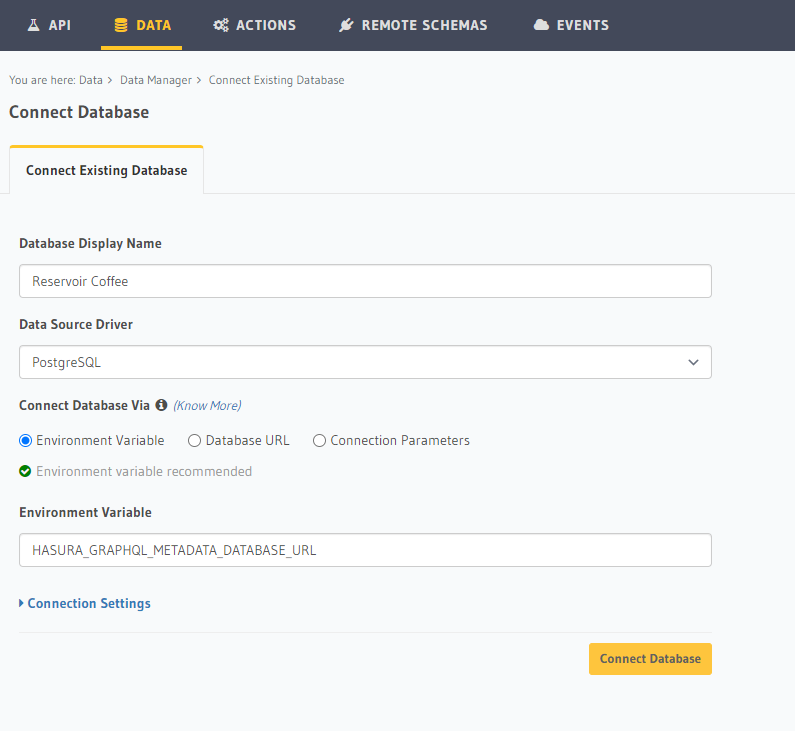
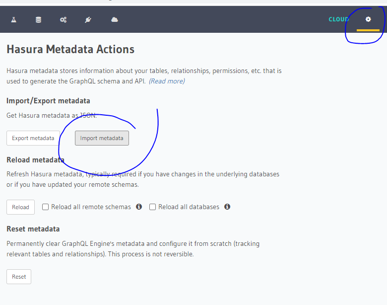

1. Install docker & docker-compose  ( https://docs.docker.com/engine/install/ )
2. Create .env file with GRAPHQL_PW login password
3. From terminal run "docker-compose up -d"
4. Hasura login: http://localhost:8080/ with GRAPHQL_PW password
5. Attach database using HASURA_GRAPHQL_METADATA_DATABASE_URL environment variable

6. Run SQL scripts from this folder in Data > SQL page
7. Import Hasura Metadata 

8. Test to see if REST API is working ( http://localhost:8080/api/rest/business_info ) 

TODOs:
 - Use Hasura CLI to reduce steps and simplify migrations

